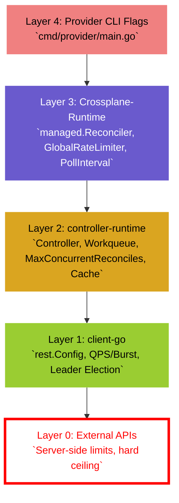
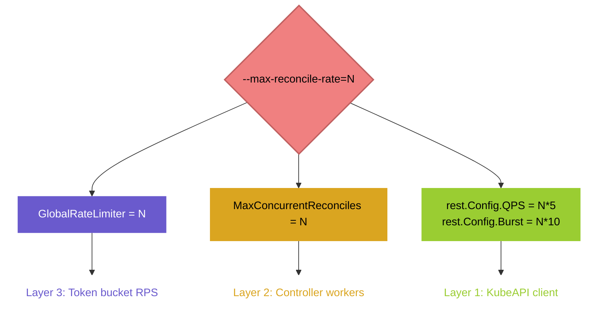

import Tabs from '@theme/Tabs';
import TabItem from '@theme/TabItem';

# 🔧 Performance Considerations for Crossplane Providers

> **What you'll learn:** This advanced guide explains the tunable knobs (parameters) that control Crossplane provider behavior at scale. You'll understand how these parameters interact, what defaults mean, and how to tune them for different landscape sizes.

## Overview

> **Sources:** [Crossplane rate-limiting design][src-crossplane-rate-limiting]

A Crossplane provider reconciles managed resources against external cloud APIs. Effective throughput is governed by **layered mechanisms** - each layer has its own capacity and constraints. The effective throughput is bounded by the **most restrictive layer**.

This document follows a **bottom-up approach**:

0. External APIs (the hard ceiling you cannot control)
1. Kubernetes API client limits (HTTP transport to your cluster)
2. Controller-runtime (generic K8s controller framework)
3. Crossplane-runtime (Crossplane-specific machinery)
4. CLI flags (the knobs you actually turn)

## The Configuration Stack

### From CLI Flags to External APIs

### Layer Descriptions

| Layer | Purpose | What You Control | Default Ownership |
|-------|---------|------------------|-------------------|
| **4. CLI Flags** | Entry point for operators | Flags like --max-reconcile-rate, --poll-interval | Provider code |
| **3. crossplane-runtime** | Crossplane-specific reconciliation logic | Managed by Crossplane; some tunable via CLI | crossplane/crossplane-runtime |
| **2. controller-runtime** | Kubernetes controller framework | Defaults overridden by crossplane-runtime | kubernetes-sigs/controller-runtime |
| **1. client-go** | HTTP client to Kubernetes API | Tunable via CLI-derived values | kubernetes/client-go |
| **0. External APIs** | Cloud APIs (AWS, GCP, BTP, CF, etc.) | **Not tunable** - this is the hard ceiling | External service |

---

## The --max-reconcile-rate Fan-Out

> **Sources:** [Crossplane rate-limiting design][src-crossplane-rate-limiting], [crossplane-runtime rate limiter defaults][src-xruntime-ratelimiter], [BTP provider flags and wiring][src-btp-main], [Cloud Foundry provider flags and wiring][src-cf-main]

A single flag controls **three independent parameters**. This coupling is the most important concept to understand:

### One flag, three independent parameters

---

## Reconcile Flow - How Layers Compose

When a reconcile is triggered, the layers are checked in order. The effective throughput is bounded by the most restrictive layer.

---

## Key Parameters Explained

### 1. MaxConcurrentReconciles

> **Sources:** [controller-runtime controller options][src-controller-runtime-options], [controller-runtime worker startup][src-controller-runtime-workers], [Crossplane rate-limiting design][src-crossplane-rate-limiting]

**What it controls:** The number of worker goroutines that can reconcile resources in parallel.

**Default:** 1 (framework default)

**Configured via:** --max-reconcile-rate (coupled with other parameters)

**How it works:**
- Each controller spawns exactly N workers (fixed count, not elastic)
- The workqueue guarantees the same resource is never concurrently reconciled by two workers
- Bottleneck is typically I/O  (network) wait, not CPU - concurrency can safely exceed CPU cores
- Higher concurrency also increases parallel API activity. This can create short request spikes and hit external API rate limits, especially burst limits, during restarts, failovers, or when many resources are queued at once.

**Provider-specific behavior:**

<Tabs>
  <TabItem value="upjet" label="upjet/Terraform">
    For Terraform-based controllers, concurrency > 1 may cause issues because Terraform itself is not thread-safe. Most upjet controllers set this to 1.
  </TabItem>
  <TabItem value="provider-sdk" label="Provider SDK (go-sdk)">
    Go-based providers typically use concurrency > 1 safely. Default in provider-gcp, provider-helm, provider-kubernetes is 100.
  </TabItem>
</Tabs>

**Tuning:**
- Small landscape (< 100 resources): 1-5
- Medium landscape (100-500): 5-10
- Large landscape (500-2000): 10-20
- XL landscape (2000+): 20+

### 2. Global Rate Limiter (RPS)

> **Sources:** [crossplane-runtime rate limiter defaults][src-xruntime-ratelimiter], [crossplane-runtime rate-limiting reconciler][src-xruntime-rate-reconciler]

**What it controls:** A token-bucket rate limiter that throttles reconcile attempts across this provider before they reach the actual resource reconciler.

**Default:** Same value as --max-reconcile-rate (coupled)

**How it works:**
- Tokens are replenished at N per second, with a burst capacity of N × 10
- Before the actual resource reconciler is called, Crossplane consults the global token-bucket limiter
- If the request can run immediately, it proceeds
- If no token is currently available, Crossplane reserves a future slot and returns `RequeueAfter` for the token-bucket delay
- When that same rate-limited request comes back after the delay, Crossplane lets it through once without consulting/consuming the limiter again
- This prevents an item from being rate-limited repeatedly forever before it ever reaches the actual reconciler

**Important nuance:** The global limiter is not exponential backoff. Its delay is based on token availability. Per-item exponential backoff for reconcile errors is handled separately by the workqueue backoff described below.

### 3. Poll Interval

> **Sources:** [crossplane-runtime poll interval options][src-xruntime-poll], [BTP provider flags and wiring][src-btp-main], [Cloud Foundry provider flags and wiring][src-cf-main], [provider-helm flags][src-provider-helm], [provider-kubernetes flags][src-provider-kubernetes], [provider-sql flags][src-provider-sql]

**What it controls:** For successfully reconciled resources, how often Crossplane schedules the next reconcile to observe external state and check for drift. See also [Poll Jitter](#7-poll-jitter), which adds a random offset to this interval to spread requeues over time.

**Default:** 1 minute (most providers)

**How it works:**
- Creates steady-state RPS = N_resources / PollInterval
- 1000 resources with 1m poll = ~16.7 polls/sec
- Poll-triggered reconcile attempts are subject to the `GlobalRateLimiter`
- Polling is typically scheduled with `RequeueAfter`; when a reconcile returns `RequeueAfter`, controller-runtime clears per-item failure backoff for that request

**Tuning:**
- Small ({'<' + '100'}): 1 minute
- Medium (100-500): 1-5 minutes
- Large (500-2000): 3-5 minutes + 30s jitter
- XL (2000+): 5-10 minutes + 1m jitter

### 4. Backoff (Per-Item Sequential)

> **Sources:** [Crossplane rate-limiting design][src-crossplane-rate-limiting], [crossplane-runtime controller backoff][src-xruntime-controller-backoff], [BTP provider backoff flags][src-btp-main]

**What it controls:** Exponential backoff for individual resource reconcile failures.

**Default:** Base 1s, max 60s (framework default, not per-provider)

**How it works:**
- Starts at 1s after first failure
- Doubles each subsequent failure: 2s, 4s, 8s, 16s, 32s, caps at 60s
- Cleared by successful reconcile or RequeueAfter
- Workers pick the item with earliest backoff expiry from the workqueue

**Pitfall:** Without RequeueAfter, a transient error can snowball to 60s wait - then the resource is effectively dead for a full minute.

### 5. QPS and Burst (client-go)

> **Sources:** [crossplane-runtime REST config limiting][src-xruntime-ratelimiter], [client-go REST config][src-client-go-rest-config], [Crossplane rate-limiting design][src-crossplane-rate-limiting]

**What it controls:** HTTP request rate to the Kubernetes API server.

**Default:** Derived from --max-reconcile-rate: QPS = N × 5, Burst = N × 10

**How it works:**
- Each reconcile makes multiple KubeAPI calls (typically 5-10)
- QPS limits sustained request rate
- Burst allows short spikes above QPS
- Leader election renewal consumes 1 QPS per renewal cycle

**Tuning:** QPS/Burst are derived from `--max-reconcile-rate`, so they normally increase together with the reconcile concurrency configured through that flag. If provider logs or metrics show Kubernetes API client-side throttling, you can increase QPS/Burst, but do so gradually while monitoring API server latency, 429 responses, request saturation, and overall control-plane health. Raising these values only removes the provider-side client limit; the Kubernetes API server may still enforce its own limits per client, service account, priority level, or request type.

### 6. Leader Election

> **Sources:** [controller-runtime manager leader-election options][src-controller-runtime-manager], [controller-runtime leader-election defaults][src-controller-runtime-leader-defaults], [BTP provider leader-election wiring][src-btp-main], [Cloud Foundry provider leader-election wiring][src-cf-main]

**What it controls:** Prevents multiple replicas from reconciling simultaneously.

**Default:** Disabled by default in the BTP and Cloud Foundry providers (`--leader-election=false`). If enabled without overrides, controller-runtime uses its own leader-election defaults; these providers override the lease timings.

**How it works:**
- Lease-based: controller-runtime defaults to 15s lease duration, 10s renew deadline, and 2s retry period; BTP and Cloud Foundry override this to 60s lease duration and 50s renew deadline
- Lease renewal is a KubeAPI call - consumes QPS
- On failover: creates momentary thundering herd as all resources are requeued

**Consideration:** Leader election mainly matters for multi-replica deployments, where it enables a standby provider pod to take over quickly if the active pod fails. For most Crossplane provider use cases this immediate failover is not required: reconciliation is eventually consistent, and steady-state drift detection is driven by the poll interval, so a short pod restart or rescheduling delay usually only postpones reconciliation briefly. In single-replica deployments, leader election therefore adds Kubernetes API overhead without providing practical availability benefits. Some providers allow disabling it.

### 7. Poll Jitter

> **Sources:** [crossplane-runtime poll jitter hook][src-xruntime-poll-jitter], [provider-kubernetes poll jitter flag][src-provider-kubernetes]

**What it controls:** Random offset added to PollInterval to spread requeues over time.

**Default:** None (BTP, CF); 5% (provider-gcp); 10% (provider-kubernetes flag)

**How it works:**
- Without jitter: all resources requeue exactly at the same time after a restart or failover
- With jitter: requeues spread over PollInterval ± jitter%, reducing load spikes

**Critical for:** Environments with many resources (>500) or frequent restarts.

**Recommendation:** Poll jitter should be enabled by default for all providers. It has little practical downside and helps spread polling over time, reducing burst load on Kubernetes and external APIs — especially in shared environments with many teams or many managed resources.

### 8. Reconcile Timeout

> **Sources:** [crossplane-runtime timeout defaults][src-xruntime-timeout-defaults], [crossplane-runtime timeout option and grace period][src-xruntime-timeout], [Cloud Foundry Service Instance timeout][src-cf-serviceinstance-timeout], [provider-helm timeout flag][src-provider-helm]

**What it controls:** Maximum time allowed for the external reconcile operations (`Connect`, `Observe`, `Create`, `Update`, `Delete`) of a single resource.

**Default:** 1 minute (most providers); some use 3m, 5m, or 10m

**How it works:**
- Crossplane applies the configured timeout to external provider operations
- The reconciler also gets an additional 30s `reconcileGracePeriod` to update status, emit events, disconnect clients, and clean up after external operations finish or time out
- If an external operation exceeds the configured timeout, it is canceled with a context deadline error
- This triggers exponential backoff
- Terraform Apply can take minutes for large resources

**Provider variations:**
- **BTP:** 1m (most), 3m (some operations like Service Instance creation)
- **CF:** 1m (most), 5m (Service Instance)
- **provider-gcp:** 3m
- **provider-helm:** 10m
- **provider-kubernetes:** 1m
- **provider-sql:** 1m

---

## Tuning by Landscape Size

| Resources | MaxConc | RPS | Poll | QPS/Burst | Notes |
|-----------|---------|-----|------|-----------|-------|
| **{'<' + '100'}** | 1-5 | 1-5 | 1m | 25/50 | Defaults are fine |
| **100-500** | 5-10 | 5-10 | 1m + 10% | 50/100 | CF default (10) reasonable |
| **500-2000** | 10-20 | 10-20 | 3-5m + 30s | 150/300 | Must respect external API limits |
| **2000+** | 20+ | 20+ | 5-10m + 1m | 250/500 | External APIs bottleneck; consider sharding |

**Key principles:**
1. External APIs are the **hard ceiling** - tune internal parameters below this limit
2. Polling creates steady-state RPS = N ÷ P - factor this into your budget
3. Backoff base delays prevent thundering herd on mass failures
4. Poll jitter spreads restart-time requeues over a time window

---

## Provider Defaults Comparison

| Provider | MaxConc/RPS | Poll | Sync | Timeout | Jitter |
|----------|-------------|------|------|---------|--------|
| **BTP** | 3 | 1m | 1h | 1m (some 3m) | None |
| **CF** | 10 | 1m | 1h | 1m (SI: 5m) | None |
| provider-gcp | 100 | 10m | 1h | 3m | 5% (hardcoded) |
| provider-helm | 100 | 10m | 1h | 10m | None |
| provider-kubernetes | 100 | 10m | 1h | 1m | 10% (flag) |
| provider-sql | 10 | 10m | 1h | 1m | None |

---

## Common Pitfalls

1. **Ignoring external API limits** - Setting internal RPS higher than external API capacity generates 429 errors and spurious backoff
2. **No poll jitter** - All resources requeue simultaneously after restart, causing thundering herd
3. **Hardcoded 1m timeouts** - Terraform Apply can take minutes; some controllers need 3m-10m
4. **Coupled concurrency and RPS** - Some controllers (BTP upjet) need MaxConc=1 while others can use higher values
5. **Ignoring 429 handling** - Neither BTP nor CF providers parse rate-limit headers; 429s trigger generic backoff
6. **Underestimating KubeAPI calls** - Each reconcile makes ~5-10 KubeAPI calls; QPS must be 5x-10x RPS

---

## Summary

> **Sources:** [Crossplane rate-limiting design][src-crossplane-rate-limiting], [crossplane-runtime controller options][src-xruntime-options], [crossplane-runtime rate limiter defaults][src-xruntime-ratelimiter]

Understanding Crossplane provider parameters requires understanding the **layered architecture**:

1. **CLI flags** are the entry point you control
2. **Crossplane-runtime** implements the core reconciliation logic with rate limiting
3. **controller-runtime** provides the generic Kubernetes controller framework
4. **client-go** handles HTTP communication with your Kubernetes cluster
5. **External APIs** are the hard ceiling you cannot tune

The key insight: **parameters interact across layers**, and the effective throughput is bounded by the most restrictive layer. Start by understanding external API limits, then tune internal parameters to operate safely below that ceiling.

[src-crossplane-rate-limiting]: https://github.com/crossplane/crossplane/blob/main/design/one-pager-rate-limiting.md
[src-xruntime-options]: https://github.com/crossplane/crossplane-runtime/blob/v1.20.0/pkg/controller/options.go#L29-L72
[src-xruntime-ratelimiter]: https://github.com/crossplane/crossplane-runtime/blob/v1.20.0/pkg/ratelimiter/default.go#L48-L56
[src-xruntime-controller-backoff]: https://github.com/crossplane/crossplane-runtime/blob/v1.20.0/pkg/ratelimiter/default.go
[src-xruntime-rate-reconciler]: https://github.com/crossplane/crossplane-runtime/blob/v1.20.0/pkg/ratelimiter/reconciler.go#L29-L84
[src-xruntime-poll]: https://github.com/crossplane/crossplane-runtime/blob/v1.20.0/pkg/reconciler/managed/reconciler.go#L620-L655
[src-xruntime-poll-jitter]: https://github.com/crossplane/crossplane-runtime/blob/v1.20.0/pkg/reconciler/managed/reconciler.go#L657-L666
[src-xruntime-timeout-defaults]: https://github.com/crossplane/crossplane-runtime/blob/v1.20.0/pkg/reconciler/managed/reconciler.go#L48-L49
[src-xruntime-timeout]: https://github.com/crossplane/crossplane-runtime/blob/v1.20.0/pkg/reconciler/managed/reconciler.go#L610-L618
[src-controller-runtime-options]: https://github.com/kubernetes-sigs/controller-runtime/blob/v0.20.0/pkg/config/controller.go#L22-L62
[src-controller-runtime-workers]: https://github.com/kubernetes-sigs/controller-runtime/blob/v0.20.0/pkg/internal/controller/controller.go#L233-L243
[src-controller-runtime-manager]: https://github.com/kubernetes-sigs/controller-runtime/blob/v0.20.0/pkg/manager/manager.go#L148-L221
[src-controller-runtime-leader-defaults]: https://github.com/kubernetes-sigs/controller-runtime/blob/v0.20.0/pkg/manager/internal.go#L51-L54
[src-client-go-rest-config]: https://github.com/kubernetes/client-go/blob/v0.35.2/rest/config.go#L46-L165
[src-btp-main]: https://github.com/SAP/crossplane-provider-btp/blob/07c20cea2ac3531f0040e5fa31aae38d260f8708/cmd/provider/main.go#L33-L119
[src-cf-main]: https://github.com/SAP/crossplane-provider-cloudfoundry/blob/84e25a76497da078b3ec35376eae8f4ae522805f/cmd/provider/main.go#L34-L119
[src-cf-serviceinstance-timeout]: https://github.com/SAP/crossplane-provider-cloudfoundry/blob/84e25a76497da078b3ec35376eae8f4ae522805f/internal/controller/serviceinstance/controller.go#L66-L66
[src-provider-helm]: https://github.com/crossplane-contrib/provider-helm/blob/master/cmd/provider/main.go#L71-L195
[src-provider-kubernetes]: https://github.com/crossplane-contrib/provider-kubernetes/blob/main/cmd/provider/main.go#L80-L250
[src-provider-sql]: https://github.com/crossplane-contrib/provider-sql/blob/master/cmd/provider/main.go#L44-L108
